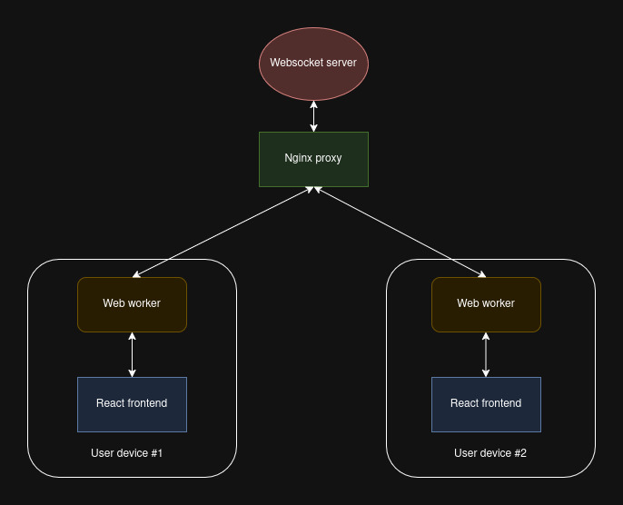

# Multibump
An over-engineered real-time browser multiplayer game. The players bump into each other and other things in an attempt to reach the goal first.

The current implementation is designed with two players in mind, however, the current implementation allows more players at the same time.

## Architecture

The architecture is based on one server connecting multiple clients using websocket connections between the server and clients. All communication between client is done via the backend server.



*Diagram of the current architecture*

## Technologies

The frontend is written with React JS and PixiJS, allowing a moderately deep level of modification of graphics. The backend is written using Node JS. Both the frontend and backend use reverse proxies which are configured using Nginx.

To achieve respectable levels of performance, the communication from the frontend to the backend is handled by a web worker. The worker connects to the backend server via Websocket and handles bidirectional communication between the frontend and the backend.

## Running the app

The app can be run using docker compose with the command:
```
docker compose up
```

The current implementation doesn't need any environment variables.

Docker compose will need to be installed for this to work. Installation instructions can be found here: https://docs.docker.com/compose/install/

## Rooms feature

Players can join different rooms by specifying the 'room' parameter in the URL. This adds a certain level of security for each game. Currently only 2 people can be in one game.

## Progress and plan

Currently the core functionality is complete. Meaning that players are able to see each other move and move themselves in real time.

The current user experience is quite plain and would work well with more content. More features can be expected in the future.